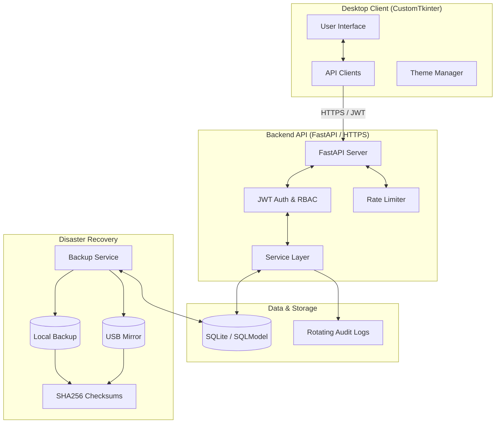

# MTO Treasury System Architecture

This document provides a high-level overview of the system components and their interactions.

## Component Overview

The system follows a modern **Client-Server Architecture** designed for security, scalability, and data integrity.

## Key Architectural Decisions

1.  **N-Tier Layered Design:** The code is separated into UI, API Clients, Service Layer, and Data Access (DB Manager). This prevents "God Objects" and makes maintenance easier.
2.  **Security-First Backend:** The server enforces HTTPS, CORS, and Rate Limiting at the infrastructure level.
3.  **Stateless RBAC:** Roles and permissions are embedded in JWT tokens, reducing database load and improving response times.
4.  **Hybrid Disaster Recovery:** Backups are automated across multiple locations (Local, USB) with cryptographic verification (SHA256).
5.  **Thread-Safe UI:** The desktop interface utilizes an asynchronous messaging system (`self.after()`) to prevent crashes during background data fetching.
